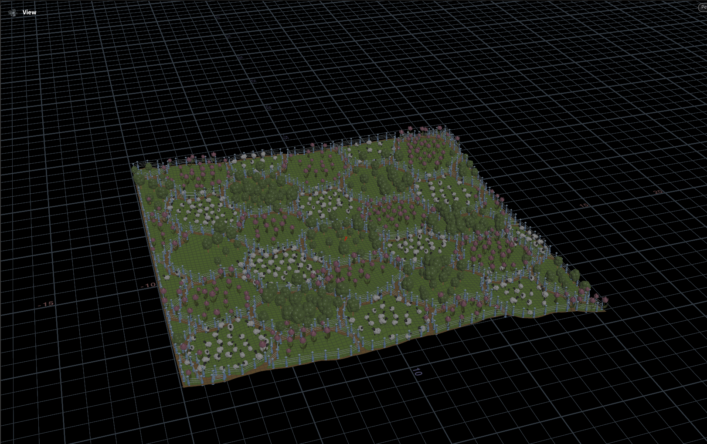
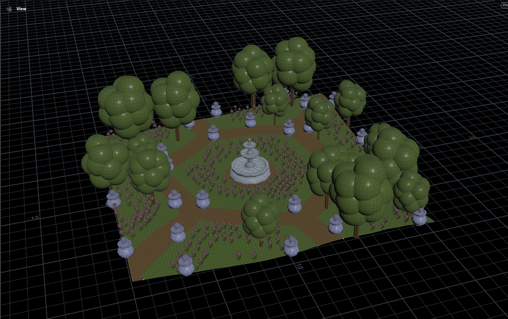
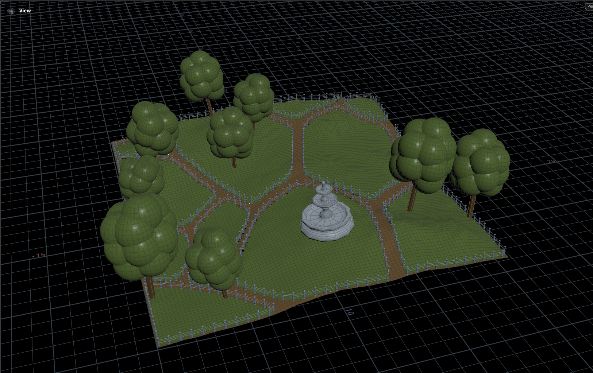
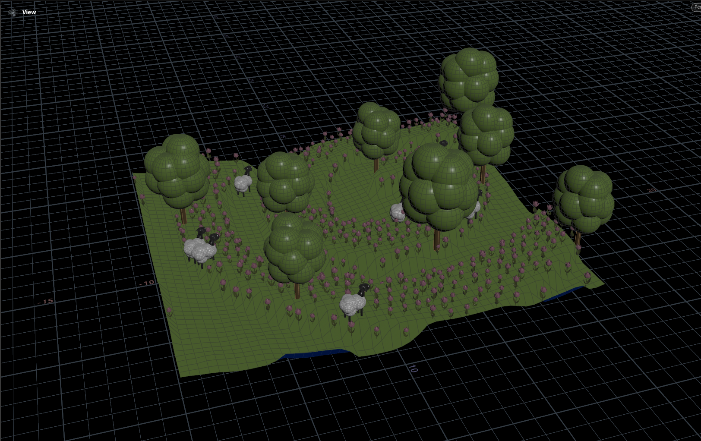

# A Garden Generator Houdini Digital Asset

This asset procedurally generates a garden model with varied terrain, paths and geometry scattered.

It can take in custom geometry input to use and be used to generate environment for a scene, imported geometry from file or used with dummy geometry provided.
It can have up to 5 objects included: 3 scatterable, 1 places along the paths and 1 centerpiece to be moved around.

 |  
--- | --- 
 | 

## Instructions

Place the HDA file (`hda/sop_s5000836.dev.garden.1.0.hdanc`) into your `$HOUDINIPATH/otls` folder to be available in any file. Then create `Garden Generator (Dev)` node to use the asset. It comes with a help card explaining all the inputs and their role.